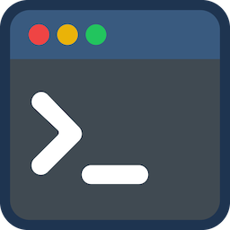
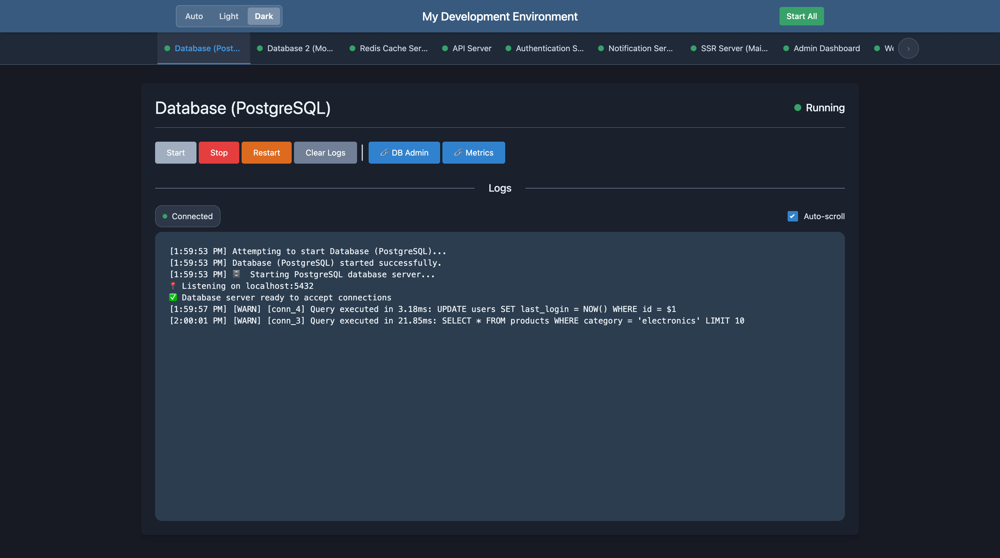

# Dev Services Dashboard v0.1.0

[](https://badge.fury.io/js/dev-services-dashboard)



A lightweight development UI dashboard for managing and monitoring multiple services during local development.

[](screenshot.png)

<!-- toc -->

- [Overview](#overview)
- [Features](#features)
- [Usage](#usage)
  - [Quick Setup](#quick-setup)
  - [Configuration Options](#configuration-options)
    - [Return Value](#return-value)
  - [Service Configuration](#service-configuration)
    - [Web Links](#web-links)
    - [Custom Signals](#custom-signals)
    - [Startup Ordering With dependsOn](#startup-ordering-with-dependson)
    - [Pre-Start Hook (beforeStart)](#pre-start-hook-beforestart)
    - [Post-Start Hook (afterStart)](#post-start-hook-afterstart)
    - [Process Termination](#process-termination)
  - [Logger Configuration](#logger-configuration)
    - [No Logging by Default](#no-logging-by-default)
    - [Using the Console Logger](#using-the-console-logger)
    - [Creating a Custom Logger](#creating-a-custom-logger)
    - [Disabling Logging](#disabling-logging)
- [Example](#example)
- [Demo](#demo)
- [Development](#development)
  - [Project Structure](#project-structure)
  - [backend](#backend)
  - [frontend-react](#frontend-react)
  - [frontend-build](#frontend-build)
  - [Technical Details](#technical-details)
- [Future Goals](#future-goals)

<!-- tocstop -->

## Overview

Dev Services Dashboard provides a web-based dashboard to:

- Start, stop, and restart development services
- Monitor service logs in real-time
- Track service status (running, stopped, error, etc.)
- Manage multiple services from a single interface
- Define and spin up your entire local development stack (databases, APIs, web servers, etc.)

Perfect for local development where you need to run multiple interdependent services that would typically be separate managed services in production (databases, caches, message queues, microservices, etc.).

## Features

- **Real-time Logs**: View service logs as they happen. ANSI escape sequences (CSI and OSC) — color/style as well as cursor moves and clear-line/clear-screen "spam" are stripped, since logs are rendered as plain text
- **Log Management**: Clear a service's log buffer from the UI ("Clear Logs"). This clears it on the server and for all connected clients (a single `Log buffer cleared by user.` system line is then written in its place)
- **Service Controls**: Start, stop, restart services individually or all at once ("Start All" / "Stop All")
- **Status Monitoring**: Visual indicators for service status
- **Startup Ordering**: Declare `dependsOn` so services start in dependency order (and stop in reverse)
- **Custom Signals**: Send declared POSIX signals (`SIGHUP`, `SIGUSR1`, …) to a running service from the UI
- **Pre-start Hooks**: Run an async `beforeStart` hook to prepare env/state before a service spawns
- **Post-start Hooks**: Run an async `afterStart` hook as a readiness gate after spawn (wait for a port, run a migration). Throwing fails the startup
- **Web Links**: Quick access buttons to related URLs (docs, admin panels, health checks, etc.)
- **Connection Status**: Clear indication of connection state with automatic reconnection
- **Responsive Design**: Works on desktop and mobile devices

## Usage

### Quick Setup

1. **Install the package:**

   ```bash
   bun add dev-services-dashboard
   # or
   npm add dev-services-dashboard
   # or
   yarn add dev-services-dashboard
   ```

2. **Create a dev runner script** (e.g., `scripts/dev-ui-runner.ts`):

   ```typescript
   import {
     createConsoleLogger,
     startDevServicesDashboard,
     type UserServiceConfig,
   } from "dev-services-dashboard";

   const services: UserServiceConfig[] = [
     {
       id: "db",
       name: "Database (Postgres)",
       command: ["bun", "run", "scripts/dev-db.ts"],
     },
     {
       id: "api",
       name: "API Server",
       command: ["bun", "run", "src/apps/api-server/index.ts"],
       env: { NODE_ENV: "development" },
       webLinks: [
         { label: "API Docs", url: "http://localhost:3001/docs" },
         { label: "Health Check", url: "http://localhost:3001/health" },
       ],
     },
   ];

   startDevServicesDashboard({
     dashboardName: "My Project Dashboard",
     port: 4000,
     hostname: "localhost",
     maxLogLines: 200,
     defaultCwd: process.cwd(),
     services,
     logger: createConsoleLogger(),
   });

   console.log("Dev Services Dashboard Started!");
   ```

3. **Add a script to your `package.json`:**

   ```json
   {
     "scripts": {
       "dev:dashboard": "bun run scripts/dev-ui-runner.ts"
     }
   }
   ```

4. **Run your dashboard:**

   ```bash
   bun run dev:dashboard
   ```

   **Note**: This Quick Setup example uses Bun, but you can also use Node.js with ts-node or regular JavaScript:

```bash
# With ts-node (for TypeScript)
  npx ts-node scripts/dev-ui-runner.ts

 # Or with regular Node.js (rename to .js and remove types)
 node scripts/dev-ui-runner.js
```

5. **Open your browser** to `http://localhost:4000` to access the dashboard (or on your custom defined port)

### Configuration Options

The `startDevServicesDashboard` function accepts a configuration object with the following properties:

| Option               | Type                               | Default                  | Description                                                                                                                                                                                                                                                                                                                                                                                                                                                                                                                                    |
| -------------------- | ---------------------------------- | ------------------------ | ---------------------------------------------------------------------------------------------------------------------------------------------------------------------------------------------------------------------------------------------------------------------------------------------------------------------------------------------------------------------------------------------------------------------------------------------------------------------------------------------------------------------------------------------- |
| `port`               | number                             | 4000                     | The port to run the Dev Services Dashboard server on. `0` and other non-positive values fall back to `4000` (so `port: 0` does **not** request an OS-assigned ephemeral port)                                                                                                                                                                                                                                                                                                                                                                  |
| `hostname`           | string                             | 'localhost'              | The hostname to bind the server to                                                                                                                                                                                                                                                                                                                                                                                                                                                                                                             |
| `maxLogLines`        | number                             | 200                      | Maximum number of log lines to keep in memory per service                                                                                                                                                                                                                                                                                                                                                                                                                                                                                      |
| `defaultCwd`         | string                             | process.cwd()            | Default working directory for services                                                                                                                                                                                                                                                                                                                                                                                                                                                                                                         |
| `dashboardName`      | string                             | 'Dev Services Dashboard' | Custom name for the dashboard displayed in the UI and page title                                                                                                                                                                                                                                                                                                                                                                                                                                                                               |
| `stopTimeout`        | number                             | 5000                     | Default ms to wait after SIGTERM before escalating to SIGKILL on stop (per-service `stopTimeout` overrides)                                                                                                                                                                                                                                                                                                                                                                                                                                    |
| `startTimeout`       | number                             | 10000                    | The **spawn window only**: ms a start waits for the process to come up, reaching `running` or entering `finalizing` if the service has an `afterStart` hook, before failing it (tears the process down, marks it `error`). The `beforeStart`/`afterStart` phases are bounded **separately** by `beforeStartTimeout` / `afterStartTimeout`, so a service with hooks can take up to their sum to reach `running`, not `startTimeout` alone. Applies to any start, whether manual, restart, or "Start All" (which then also skips its dependents) |
| `beforeStartTimeout` | number                             | 60000                    | Ms a start waits during a service's `beforeStart` (`initializing`) phase before failing it (aborts the hook, marks it `error`). Applies to any start, whether manual, restart, or "Start All" (which then also skips its dependents)                                                                                                                                                                                                                                                                                                           |
| `afterStartTimeout`  | number                             | 60000                    | Ms a start waits during a service's `afterStart` (`finalizing`) phase before failing it (aborts the hook, tears the process down, marks it `error`). Applies to any start, whether manual, restart, or "Start All" (which then also skips its dependents)                                                                                                                                                                                                                                                                                      |
| `services`           | UserServiceConfig[]                | required                 | Array of service configurations                                                                                                                                                                                                                                                                                                                                                                                                                                                                                                                |
| `logger`             | DevServicesDashboardLoggerFunction | none (no logging)        | Custom logger function for Dev Services Dashboard internal logs                                                                                                                                                                                                                                                                                                                                                                                                                                                                                |

**Note**: All numeric options treat any non-positive or non-finite value (`0`, a negative number, or `NaN`) as "unset" and fall back to their defaults: `port` (`4000`), `maxLogLines` (`200`), `stopTimeout` (`5000`), `startTimeout` (`10000`), and `beforeStartTimeout` / `afterStartTimeout` (`60000`), including the per-service `stopTimeout`. So there's no way to disable the log buffer with `maxLogLines: 0` (use a small positive number instead) or to force an immediate `SIGKILL` with `stopTimeout: 0`, and a stray negative value can't empty the buffer or collapse a timeout to `0ms`. Likewise, an empty, whitespace-only, or non-string `hostname` or `dashboardName` falls back to its default (`localhost` and `Dev Services Dashboard` respectively), and a valid one is trimmed of surrounding whitespace.

> **⚠️ Binding & network exposure**: `hostname` defaults to `localhost` (the loopback interface, `127.0.0.1`/`::1`), which only accepts connections from your own machine, so other devices on the network can't reach it. Set it to `0.0.0.0` (bind **all** interfaces) or a specific interface IP to make the dashboard reachable from other devices on your LAN, but the dashboard has **no authentication** and can start, stop, and signal arbitrary processes on the host, so only expose it on a network you trust. (Note: `0.0.0.0` is the _most_ exposed binding, not the most private. It's the opposite of `localhost`.)

#### Return Value

`startDevServicesDashboard` is **async**. It returns a `Promise<DevUIServer>` that resolves once the HTTP server is listening (and rejects if it fails to bind, e.g. the port is in use). The examples in this README call it fire-and-forget for brevity, but for clean error handling and programmatic shutdown you'll usually want to `await` it:

```typescript
const dashboard = await startDevServicesDashboard({ services });
// ... later, to shut down gracefully (stops all services, then closes the server):
await dashboard.stop();
```

The resolved `DevUIServer` object exposes:

| Property     | Type                | Description                                                                                                               |
| ------------ | ------------------- | ------------------------------------------------------------------------------------------------------------------------- |
| `httpServer` | http.Server         | The underlying Node HTTP server                                                                                           |
| `wsServer`   | WebSocketServer     | The underlying `ws` WebSocket server                                                                                      |
| `port`       | number              | The port the server is listening on (the normalized config `port`, a non-positive value falls back to the default `4000`) |
| `stop`       | () => Promise<void> | Stops all running services, then closes the HTTP and WebSocket server                                                     |

The dashboard's own UI talks to the server over `wsServer`, but it's the raw `ws` server, so you can attach your own listeners too. If you want to read the frames the server broadcasts (or send your own), the wire protocol types are exported: `ServerMessage` and `ClientMessage` (the discriminated unions for each direction), plus `InitialStateService`, `LogEntry`, `ServiceStatusValue`, and `StartAllResult` / `StopAllResult` (the per-service `result` values in the Start All / Stop All progress frames).

A service is always in exactly one `ServiceStatusValue` state:

| Status         | Meaning                                                                                                                                                                                                                                                                                                                                                                                                                                                                                                                                        |
| -------------- | ---------------------------------------------------------------------------------------------------------------------------------------------------------------------------------------------------------------------------------------------------------------------------------------------------------------------------------------------------------------------------------------------------------------------------------------------------------------------------------------------------------------------------------------------- |
| `stopped`      | Not running: the initial state, the result of a stop, a clean exit (code `0`), or termination by `SIGTERM`/`SIGINT`. When the exit came from an _external_ `SIGTERM`/`SIGINT` (not a dashboard stop), `errorDetails` carries the reason (e.g. `Terminated by SIGTERM`) even though the state is `stopped`                                                                                                                                                                                                                                      |
| `initializing` | Running its `beforeStart` hook before the process has spawned (bounded by `beforeStartTimeout`)                                                                                                                                                                                                                                                                                                                                                                                                                                                |
| `starting`     | The process is being spawned, between the spawn and reaching `running`/`finalizing` (bounded by `startTimeout`)                                                                                                                                                                                                                                                                                                                                                                                                                                |
| `finalizing`   | The process is up and running its `afterStart` readiness hook, not yet reported ready (bounded by `afterStartTimeout`)                                                                                                                                                                                                                                                                                                                                                                                                                         |
| `running`      | Up and ready, with hooks (if any) completed                                                                                                                                                                                                                                                                                                                                                                                                                                                                                                    |
| `stopping`     | A stop is in progress: `SIGTERM` has been sent and the dashboard is waiting for the process to exit (or to escalate to SIGKILL)                                                                                                                                                                                                                                                                                                                                                                                                                |
| `error`        | A start failed because a hook threw or timed out, or the process exited non-zero with a "normal" code (any code `1`–`127`). Also the fallback for an exit that reports neither a code nor a signal (an unexpected exit)                                                                                                                                                                                                                                                                                                                        |
| `crashed`      | The process died abnormally because it was killed by a signal other than `SIGTERM`/`SIGINT` (a crash signal like `SIGSEGV`, or a custom signal the process didn't handle, see [Custom Signals](#custom-signals)), exited with a code ≥ `128`, or was force-killed (`SIGKILL`) from _outside_ the dashboard while running. (A dashboard-initiated stop that escalates to `SIGKILL` settles as `stopped`, and a start that times out and is torn down settles as `error`, so you only see `crashed` from a `SIGKILL` the dashboard didn't send.) |

If you don't `await` (or `.catch()`) the promise, a bind failure surfaces as an unhandled promise rejection. The dashboard also installs `SIGINT`/`SIGTERM` handlers that stop all services and exit, so `Ctrl+C` shuts things down cleanly without calling `stop()` yourself.

### Service Configuration

Each service is defined with the following properties:

| Property           | Type                                                            | Required | Description                                                                                                                                                                                                                                                                                                                 |
| ------------------ | --------------------------------------------------------------- | -------- | --------------------------------------------------------------------------------------------------------------------------------------------------------------------------------------------------------------------------------------------------------------------------------------------------------------------------- |
| `id`               | string                                                          | Yes      | Unique identifier for the service                                                                                                                                                                                                                                                                                           |
| `name`             | string                                                          | Yes      | Display name for the service                                                                                                                                                                                                                                                                                                |
| `command`          | string[]                                                        | Yes      | Command to run (first element is the executable, rest are arguments)                                                                                                                                                                                                                                                        |
| `cwd`              | string                                                          | No       | Working directory for the command (defaults to defaultCwd)                                                                                                                                                                                                                                                                  |
| `env`              | Record<string, string>                                          | No       | Environment variables to set for the process                                                                                                                                                                                                                                                                                |
| `webLinks`         | WebLink[]                                                       | No       | Array of web links to display as buttons in the service UI                                                                                                                                                                                                                                                                  |
| `signals`          | ServiceSignal[]                                                 | No       | Custom signals you can send to the running process from the UI ([Custom Signals](#custom-signals))                                                                                                                                                                                                                          |
| `dependsOn`        | string[]                                                        | No       | IDs of services this one depends on. Affects Start All / Stop All ordering ([Startup Ordering](#startup-ordering-with-dependson))                                                                                                                                                                                           |
| `beforeStart`      | (ctx: BeforeStartContext) => Promise<BeforeStartResult \| void> | No       | Async hook run before the process spawns. May return `{ env?, webLinks? }` ([Pre-Start Hook](#pre-start-hook-beforestart))                                                                                                                                                                                                  |
| `afterStart`       | (ctx: AfterStartContext) => Promise<AfterStartResult \| void>   | No       | Async readiness gate run after spawn, before `running`. Throwing fails the startup. May return `{ webLinks? }` ([Post-Start Hook](#post-start-hook-afterstart))                                                                                                                                                             |
| `gracefulShutdown` | boolean                                                         | No       | Send the stop `SIGTERM` to only the main process (so it can shut down its own children) instead of the whole group. Forced `SIGKILL` still targets the group. Default `false`. No effect on Windows, which has no process groups and always signals just the launched process ([Process Termination](#process-termination)) |
| `stopTimeout`      | number                                                          | No       | Ms to wait after SIGTERM before escalating to SIGKILL for this service. Overrides the global `stopTimeout`. When unset it **inherits** the global value (which is `5000` unless you change it)                                                                                                                              |

> **Note:** Service config is validated up front. A duplicate `id` or an empty/invalid `command` (the first element must be a non-empty executable string) is a fatal configuration error, so `startDevServicesDashboard` rejects rather than starting with an unusable service (the same way a `dependsOn` cycle or self-dependency does).

> **Note:** `command` is run **directly, not through a shell**. The first element is the executable and the rest are passed as literal arguments, so shell features won't work: `&&`/`;` chaining, `|` pipes, `>` redirects, glob expansion, and `$VAR` substitution are all treated as plain text. (Variables you set via `env` are passed to the process, but `$VAR` written _inside_ `command` is not expanded.) If you need shell semantics, invoke a shell explicitly, e.g. `command: ["sh", "-c", "foo && bar"]`.

#### Web Links

Web links appear as clickable buttons in each service's control panel. Each web link is defined with:

| Property | Type   | Required | Description                            |
| -------- | ------ | -------- | -------------------------------------- |
| `label`  | string | Yes      | Display text for the link button       |
| `url`    | string | Yes      | URL to open when the button is clicked |

**Note**: The URLs in the examples below are for demonstration purposes. Make sure the URLs you configure actually correspond to running services or endpoints that your services expose.

#### Custom Signals

Services can declare custom POSIX signals you can send to the running process from the dashboard, which is handy for reloading config (`SIGHUP`), rotating logs, or triggering app-specific behavior (`SIGUSR1` / `SIGUSR2`). A **"Send signal…"** dropdown is shown in the service's control bar whenever it declares any `signals`, but it's only enabled while the service is `running` and connected. It is disabled when the service isn't running or the dashboard has lost its connection to the server.

Each signal is defined with:

| Property | Type   | Required | Description                               |
| -------- | ------ | -------- | ----------------------------------------- |
| `label`  | string | Yes      | Display text shown in the signal dropdown |
| `signal` | string | Yes      | Signal name to send (e.g. `SIGHUP`)       |

Signals are validated on the backend twice: the name must be one this service **declared** in its `signals[]` (the allow-list, so a raw WebSocket client can't send a valid-but-undeclared signal the config never opted into), and it must be a real signal name (checked against `os.constants.signals`). A signal that fails either check is ignored (and logged) rather than sent.

> **Note:** signals require the service to be fully `running`, not merely to have a live process. A service still in its `afterStart` (`finalizing`) phase has spawned but isn't `running` yet, so a signal is refused (the UI dropdown is likewise disabled until `running`).

> **Note:** unlike stop (which signals the whole process group), a custom signal is sent only to the **launched command's main process** by design, so e.g. a `SIGHUP` "reload config" reaches the process you configured rather than every child it forked. The consequence: if your `command` is a wrapper that doesn't forward signals (`bun run …`, `vite`, `nodemon`, a shell script), the signal hits the wrapper, not the underlying dev server. To signal the inner process, run it directly or have the wrapper forward signals.

> **Note:** a signal only does something useful if the process **handles** it. Many of the signals you'd send here (`SIGHUP`, `SIGUSR1`, `SIGUSR2`, `SIGQUIT`, …) have a default action of **terminate**, so sending one to a process that hasn't installed a handler for it will kill that process. The dashboard then reports the service as `crashed` (any signal other than `SIGTERM`/`SIGINT` settles as `crashed`). So a "reload config" `SIGHUP` reloads only if your process traps `SIGHUP`; otherwise it stops the service.

```typescript
{
  id: "api",
  name: "API Server",
  command: ["bun", "run", "src/apps/api-server/index.ts"],
  signals: [
    { label: "Reload config", signal: "SIGHUP" },
    { label: "Reopen logs", signal: "SIGUSR2" },
  ],
}
```

#### Startup Ordering With dependsOn

Services can declare dependencies with `dependsOn` (an array of service `id`s). The dashboard topologically sorts services once at startup so dependencies start before the services that rely on them.

- **Start All** starts services **sequentially** in dependency order, one service at a time, waiting for each to reach `running` before starting the next. (This is true even for services with no dependency relationship: there is no parallel startup, so a large stack starts up in series.) Because it waits for each service to be `running` before moving on, a dependent naturally starts only after its dependency is up. If a service fails, only the services that depend on it (directly or indirectly) are skipped. Unrelated services later in the order keep starting, and a summary toast reports how many were skipped.
- **Stop All** stops services sequentially in **reverse** order, so dependents shut down before the dependencies they rely on.
- Starting a **single** service manually whose dependencies aren't running shows a non-blocking warning but still starts it. `dependsOn` is an orchestration hint, not enforced runtime wiring.
- An unknown dependency `id` is ignored with a warning. A **self-dependency** or a dependency **cycle** is a fatal configuration error, and the dashboard refuses to start (the error message includes the cycle path).

> **Note:** Single-service controls stay enabled during a **Start All** run, so you keep full manual control, but there's one interaction worth knowing. Start All advances by waiting for each service to reach `running`, and it treats any transition to `stopped`, `error`, or `crashed` as a failed start. So if you **stop** or **restart** (which stops first) the service Start All is currently waiting on, Start All counts it as **failed** and skips its dependents, even though a restart then brings the service back up. For a clean Start All run, wait for it to finish before stopping or restarting individual services.

```typescript
const services: UserServiceConfig[] = [
  { id: "db", name: "Database", command: ["bun", "run", "scripts/dev-db.ts"] },
  {
    id: "api",
    name: "API Server",
    command: ["bun", "run", "src/apps/api-server/index.ts"],
    dependsOn: ["db"], // waits for db before starting during Start All
  },
  {
    id: "worker",
    name: "Background Worker",
    command: ["bun", "run", "src/apps/worker/index.ts"],
    dependsOn: ["db", "api"],
  },
];
```

#### Pre-Start Hook (beforeStart)

Each service can define an async `beforeStart` hook that runs **before** the process spawns, useful for waiting on a dependency's port, running a migration, or resolving secrets. While the hook runs, the service shows an `initializing` status and is given the longer `beforeStartTimeout` (default 60000ms) rather than the spawn `startTimeout`. If it exceeds that, the hook is aborted and the service goes to `error`. (This timeout applies to every start: a manual single-service start, a restart, and "Start All".)

The hook receives a `BeforeStartContext`:

> **Note:** the hook context and return types, `BeforeStartContext`, `BeforeStartResult`, `AfterStartContext`, and `AfterStartResult`. These are all exported from the package (alongside `UserServiceConfig`), so you can type a hook written separately from the config literal, e.g. `const prepare = (ctx: BeforeStartContext) => { … }`.

| Property   | Type                   | Description                                                        |
| ---------- | ---------------------- | ------------------------------------------------------------------ |
| `env`      | Record<string, string> | The merged env (process env + service `env`) bound for the process |
| `webLinks` | WebLink[]              | The service's currently configured web links                       |
| `log`      | (line: string) => void | Writes a line to the service's log stream                          |
| `signal`   | AbortSignal            | Aborts if the service is stopped while the hook is still running   |

The hook may return an object to customize the launch (any field left out keeps its current value):

| Field      | Type                   | Effect                                                                                                     |
| ---------- | ---------------------- | ---------------------------------------------------------------------------------------------------------- |
| `env`      | Record<string, string> | Replaces the env passed to the spawned process                                                             |
| `webLinks` | WebLink[]              | Replaces the service's web links, pushed live to the dashboard (omit to leave unchanged, `[]` clears them) |

Return nothing to leave both unchanged. If the hook throws, the service is put into the `error` state, and the dashboard keeps running. If the user stops the service mid-hook, `signal` is aborted and the service returns to `stopped` (the process is never spawned). Any `webLinks` you return apply only while the service is up: they revert to the configured baseline when it stops, crashes, or errors, and are rebuilt on the next start.

> **Note:** `beforeStart` runs _before_ the process spawns, so any `webLinks` you return must be computable up front (e.g. derived from a resolved port/region). Links only known _after_ the process starts (a tunnel URL, a randomly-assigned port printed to stdout) are out of scope for this hook.

**Common uses:**

- **Wait for a dependency**: block until a database/cache port is accepting connections (or a migration finishes) before the service spawns.
- **Inject short-lived / scoped credentials**: rather than baking secrets into config, resolve them per-launch and return them in the env. For example: fetch a fresh token from a local Vault/KMS/enclave emulator (`vault server -dev`), point a service at LocalStack instead of real S3, or mint a restricted sandbox API key so a dev process can't accidentally hit production with full credentials. The `log()` callback lets you surface progress ("Fetching dev credentials…") and `signal` lets you bail cleanly if the user stops the service mid-fetch.
- **Resolve web links at launch**: return `webLinks` to swap in URLs computed from the resolved config (e.g. the port/region this run will use).

```typescript
{
  id: "api",
  name: "API Server",
  command: ["bun", "run", "src/apps/api-server/index.ts"],
  beforeStart: async ({ env, webLinks, log, signal }) => {
    log("Waiting for the database to accept connections...");

    await waitForPort(5432, { signal });

    log("Database is ready.");
    return {
      env: { ...env, DB_READY: "true" }, // augment the env for the process
      webLinks: [...webLinks, { label: "Health", url: "http://localhost:3001/health" }],
    };
  },
}
```

#### Post-Start Hook (afterStart)

Each service can define an async `afterStart` hook that runs **after** the process has spawned but **before** the service is reported `running`, so it acts as a readiness/post-start gate. While it runs, the service shows a `finalizing` status, and "Start All" waits for it to resolve before starting anything that depends on the service. This is the counterpart to `beforeStart`: use it for work that only makes sense once the process is alive, like polling its port until it actually accepts connections, running a migration against the now-running database, or registering the service somewhere.

The hook receives an `AfterStartContext`:

| Property   | Type                   | Description                                                                                                                                                                                                 |
| ---------- | ---------------------- | ----------------------------------------------------------------------------------------------------------------------------------------------------------------------------------------------------------- |
| `env`      | Record<string, string> | The env the process was spawned with                                                                                                                                                                        |
| `pid`      | number \| undefined    | The spawned process's pid                                                                                                                                                                                   |
| `webLinks` | WebLink[]              | The current live web links (what a `beforeStart` returned this run, or the configured baseline)                                                                                                             |
| `log`      | (line: string) => void | Writes a line to the service's log stream                                                                                                                                                                   |
| `signal`   | AbortSignal            | Aborts if the service is stopped while the hook runs, **or** if the process exits/crashes on its own under it, so a readiness check polling the process (`await waitForPort(port, { signal })`) can give up |

The hook may return `{ webLinks? }` to replace the service's web links (pushed live to the dashboard), handy when a link is only knowable _after_ the process is up (a tunnel URL, a port printed to stdout). Return nothing to leave them unchanged (and `[]` clears them). The context's `webLinks` is the current live set (including anything a `beforeStart` added this run), so returning `[...webLinks, x]` extends them, while returning a fresh array discards them. Links are rebuilt from the configured baseline on every (re)start (so this stays idempotent), and revert to the baseline when the service stops, crashes, or errors. A dynamically-computed link (a tunnel URL, a chosen port) doesn't linger on a dead service.

If the hook **throws**, the just-started process is torn back down (it's already live and may be holding ports) and the service ends in the `error` state, so a failed migration/readiness check acts like a failed startup, and "Start All" skips the service's dependents. If the user stops the service mid-hook, `signal` is aborted, the process is terminated, and the service goes to `stopped`. `signal` is **also** aborted if the spawned process exits or crashes on its own while the hook is still running, so a readiness check polling that process can give up rather than hang. The service then settles on whatever state the exit produced, and a hook that throws in response to the abort is still treated as a failed start (`error`). A hook that runs longer than `afterStartTimeout` (default 60000ms) is treated the same as a failure: it's aborted, the process is torn down, and the service goes to `error`. (This timeout applies to every start: a manual single-service start, a restart, and "Start All".)

> **`beforeStart` vs `afterStart`:** `beforeStart` runs _before_ the process exists (prepare env, resolve secrets, gate on a dependency). `afterStart` runs _after_ it's spawned (verify it's actually ready, run a post-launch step). Throwing from either fails the startup.

```typescript
{
  id: "db",
  name: "Database (PostgreSQL)",
  command: ["postgres", "-D", "./pgdata"],
  afterStart: async ({ log, signal }) => {
    log("Waiting for the database to accept connections...");
    await waitForPort(5432, { signal }); // throws if it never comes up

    log("Running migrations...");
    await runMigrations(); // throws on failure -> service ends in `error`

    log("Database ready.");
  },
}
```

#### Process Termination

Stopping a service sends `SIGTERM`, then escalates to `SIGKILL` if it hasn't exited within the stop timeout (default 5000ms, configurable globally via `stopTimeout` or per service via `stopTimeout`).

> **Note:** **Restart** tears down whatever is in flight first: a live process (including one still coming up in `starting`/`finalizing`), or an in-flight `beforeStart` hook (`initializing`), which it aborts. An already `stopped`/`error`/`crashed` service it just starts. After tearing down a live process it waits a brief fixed settle pause (500ms) before starting again, giving the OS time to release the old process's resources (e.g. its listening port) so the fresh process doesn't immediately hit `EADDRINUSE` on a fast restart. (Restarting from `initializing` has no process to release, so that pause is skipped.)

On POSIX, services are spawned **detached** so each leads its own process group, and (by default) stop signals the **whole group** (not just the process you launched). This matters because many dev commands are wrappers, such as `bun run`, `npm run`, `vite`, `nodemon`, or a shell script, that fork the actual server as a child. Signaling only the wrapper can leave that child alive holding its port, so the next start fails with `EADDRINUSE`. Group termination reaps the wrapper and its children together.

The two behaviors below are independent. One changes how the graceful `SIGTERM` is delivered, and the other is always part of the force-kill step:

- **`gracefulShutdown: true`** (per service): changes only the **graceful** `SIGTERM` to target just the main process instead of the group, so it can coordinate shutting down its own children (useful for testing your app's graceful shutdown / signal forwarding). In this mode the main process is **responsible for its own children**: if it doesn't exit within the stop timeout it's force-killed (whole group) as a safety net, but if it exits cleanly the dashboard does **not** touch its children, so a graceful service that exits while leaving a child alive can orphan it. (The default path, by contrast, group-kills on the leader's exit, so it never orphans.) Default is to signal the whole group on `SIGTERM` too. This flag has **no effect on Windows**, where process groups aren't used and stop always signals just the launched process.
- **Escaped-children fallback**: runs as part of the force-kill (`SIGKILL`) step (when a service has to be force-killed because it didn't exit in time). The dashboard also walks the live process tree (via `ps`) and kills any descendants that left the process group (e.g. via `setsid`) which the group signal missed. Fully daemonized children (double-fork, reparented to init) are outside any tracking and won't be reaped.
- **Windows**: process groups aren't used. Stop signals just the launched process. Tree termination would require `taskkill /T` (not currently implemented), so wrapper-spawned children may survive. The dashboard is primarily tested on macOS/Linux.

### Logger Configuration

Dev Services Dashboard supports pluggable logging to integrate with your existing logging infrastructure or to disable logging entirely.

#### No Logging by Default

By default, Dev Services Dashboard doesn't log anything unless you provide a logger. Note that some non-fatal diagnostics are emitted **only** through this logger, for example an unknown `dependsOn` id being dropped or a refused signal, so they are silent unless you configure a `logger`. (A few user-facing notices, like a refused custom signal, are also written to the affected service's log stream and so still appear in the UI regardless.)

```typescript
import { startDevServicesDashboard } from "dev-services-dashboard";

// No internal logging
startDevServicesDashboard({
  services: [...],
});
```

#### Using the Console Logger

To enable console logging, use the provided console logger factory:

```typescript
import { startDevServicesDashboard, createConsoleLogger } from "dev-services-dashboard";

// Enable console logging
startDevServicesDashboard({
  services: [...],
  logger: createConsoleLogger(),
});

// For easy on/off control based on environment
const LOGGING_ENABLED = process.env.NODE_ENV === "development";
startDevServicesDashboard({
  services: [...],
  logger: createConsoleLogger(LOGGING_ENABLED),
});
```

#### Creating a Custom Logger

You can provide your own logger function:

```typescript
import { startDevServicesDashboard, type DevServicesDashboardLoggerFunction } from "dev-services-dashboard";

const customLogger: DevServicesDashboardLoggerFunction = (type, message, data) => {
  // Integrate with your logging system
  myLogger.log({
    level: type,
    message,
    data,
    service: "dev-services-dashboard"
  });
};

startDevServicesDashboard({
  services: [...],
  logger: customLogger,
});
```

#### Disabling Logging

To disable all Dev Services Dashboard internal logging:

```typescript
import { startDevServicesDashboard } from "dev-services-dashboard";

// Provide a no-op logger
startDevServicesDashboard({
  services: [...],
  logger: () => {}, // No logging
});
```

## Example

```typescript
// scripts/dev-ui-runner.ts
import {
  startDevServicesDashboard,
  type UserServiceConfig,
} from "dev-services-dashboard";

const services: UserServiceConfig[] = [
  {
    id: "db",
    name: "Database (Postgres)",
    command: ["bun", "run", "scripts/dev-db.ts"],
    webLinks: [{ label: "Admin Panel", url: "http://localhost:5432/admin" }],
  },
  {
    id: "api",
    name: "API Server",
    command: ["bun", "run", "src/apps/api-server/index.ts"],
    env: { NODE_ENV: "development" },
    webLinks: [
      { label: "API Docs", url: "http://localhost:3001/docs" },
      { label: "Health Check", url: "http://localhost:3001/health" },
    ],
  },
  {
    id: "ssr",
    name: "SSR Server (Main Website)",
    command: ["bun", "run", "src/apps/main-website/ssr-server.ts"],
    env: { NODE_ENV: "development" },
    webLinks: [
      { label: "Website", url: "http://localhost:3000" },
      { label: "Dev Tools", url: "http://localhost:3000/__dev" },
    ],
  },
];

startDevServicesDashboard({
  port: 4000,
  hostname: "localhost",
  maxLogLines: 200,
  services,
});

console.log("Dev Services Dashboard started");
```

## Demo

Want to see Dev Services Dashboard in action? We've included a demo with simulated services:

```bash
# Clone the repository
git clone https://github.com/keverw/dev-services-dashboard.git
cd dev-services-dashboard

# Install dependencies
bun install

# Run the demo (automatically builds frontend bundle)
bun run demo

# Or run the minimal tabs demo (only 3 services, perfect for testing non-scrolling tab behavior)
bun run demo-minimal-tabs
```

The demo includes simulated services that generate realistic logs:

- **Database Server**: SQL queries, connection management, and maintenance logs
- **API Server**: HTTP requests, middleware activity, and error scenarios
- **SSR Server**: Page rendering, hot reload, and build processes

Open http://localhost:4000 to explore the dashboard and try features like starting/stopping services, viewing real-time logs, "Start All" / "Stop All" (the demo wires up `dependsOn` so services come up in order), sending a custom signal to a running service, watching the API server's `beforeStart` warm-up (`initializing`) step, and the database's `afterStart` readiness/migration (`finalizing`) step.

## Development

Dev Services Dashboard is built with TypeScript and uses modern JavaScript features.

```bash
# Install dependencies
bun install

# Build the project (includes React frontend build)
bun run build

# Run tests
bun test

# Run the demo (includes frontend bundle generation)
bun run demo

# Develop the React frontend with hot reload
bun run dev-frontend
```

**Note**: The React frontend is built using Vite and then bundled into a Virtual File System (VFS) during the build process. The generated `src/backend/frontend-vfs.ts` file is git-ignored as it's a build artifact, but it's required for the server to run. The demo command automatically builds the React frontend and generates this file before starting.

When preparing a new release:

1. Update the version in `package.json`
2. Update the `changelog.md` file with the new version and changes
3. Run the build command, which will automatically build the frontend assets VFS, lib distributable update the README version and changelog TOC

```bash
# Build the project (includes README version update)
bun run build
```

The build process first builds the React frontend using Vite, then creates the VFS bundle, and finally builds the backend library. It also uses the `update-readme` and `update-changelog` scripts defined in package.json. The `update-readme` script runs `markdown-toc-gen` to update the table of contents and then runs `scripts/update-readme-version.ts` to synchronize the version number in the README with the one in package.json. The `update-changelog` script also uses `markdown-toc-gen` to update the changelog's table of contents. Afterwards, you can publish the package to npm:

```bash
# Publish to npm
bun publish
```

Make sure to commit the new version back to GIT

### Project Structure

### backend

This is where the `startDevServicesDashboard` is imported from. This is responsible for managing the service underlying processes, the HTTP API and WebSocket Handler.

### frontend-react

This is where the React frontend source files are maintained. The frontend is built using Vite and TypeScript, providing a modern development experience with hot module replacement and type safety.

### frontend-build

This directory contains the built React application output from Vite. The build process compiles TypeScript, bundles JavaScript, and optimizes assets for production.

### Technical Details

The Dev Services Dashboard consists of:

- An HTTP server using Node's native `http` module that manages service processes and provides a WebSocket API
- WebSocket communication powered by the `ws` library
- A web interface that communicates with the server via WebSockets
- Real-time log streaming from services to the UI

On load, the web interface fetches its initial config (the dashboard name and the service list, with each service's `id`, `name`, `webLinks`, `signals`, and `dependsOn`) over HTTP from `/api/services-config`. All live state, including status changes, logs, link updates, and Start All / Stop All progress, then flows over the WebSocket. If you're reading frames off the exposed `wsServer` yourself, note that the server also emits an `error_from_server` message (part of the exported `ServerMessage` union) in response to a client frame it can't act on: one that isn't valid JSON, names an unknown `serviceID`, uses an unrecognized `action`, or is a `send_signal` missing its `signal` field.

## Future Goals

- **Headless Mode**: Support running Dev Services Dashboard without serving the web interface, ideal for building IDE extensions or integrating with other development tools
- **Authentication & Security**: Currently designed for local development environments without authentication. Future versions could include optional authentication mechanisms for team environments or remote access scenarios
