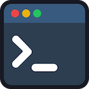

# Dev Services Dashboard v0.0.2

[](https://badge.fury.io/js/dev-services-dashboard)



A lightweight development UI dashboard for managing and monitoring multiple services during local development.

[](screenshot.png)

<!-- toc -->

- [Overview](#overview)
- [Installation](#installation)
- [Usage](#usage)
  - [Basic Setup](#basic-setup)
  - [Configuration Options](#configuration-options)
  - [Service Configuration](#service-configuration)
  - [Logger Configuration](#logger-configuration)
    - [No Logging by Default](#no-logging-by-default)
    - [Using the Console Logger](#using-the-console-logger)
    - [Creating a Custom Logger](#creating-a-custom-logger)
    - [Disabling Logging](#disabling-logging)
- [Features](#features)
- [Technical Details](#technical-details)
- [Example](#example)
- [Demo](#demo)
- [Development](#development)
- [Project Structure](#project-structure)
  - [backend](#backend)
  - [frontend](#frontend)
- [Future Ideas](#future-ideas)

<!-- tocstop -->

## Overview

Dev Services Dashboard provides a web-based dashboard to:

- Start, stop, and restart development services
- Monitor service logs in real-time
- Track service status (running, stopped, error, etc.)
- Manage multiple services from a single interface

## Installation

```bash
bun install dev-services-dashboard
# or
npm add dev-services-dashboard
# or
yarn add dev-services-dashboard
```

## Usage

### Basic Setup

1. Import the library and define your services:

```typescript
import {
  startDevServicesDashboard,
  type UserServiceConfig,
} from "dev-services-dashboard";

// Define your services
const services: UserServiceConfig[] = [
  {
    id: "db",
    name: "Database",
    command: ["bun", "run", "scripts/db-server.ts"],
  },
  {
    id: "api",
    name: "API Server",
    command: ["bun", "run", "src/apps/api-server/index.ts"],
    env: { NODE_ENV: "development" },
  },
];

// Start the Dev Services Dashboard
startDevServicesDashboard({
  port: 4000,
  hostname: "localhost",
  maxLogLines: 200,
  services,
});
```

2. Open your browser to `http://localhost:4000` to access the dashboard (or on your custom defined port)

### Configuration Options

The `startDevServicesDashboard` function accepts a configuration object with the following properties:

| Option        | Type                               | Default           | Description                                                     |
| ------------- | ---------------------------------- | ----------------- | --------------------------------------------------------------- |
| `port`        | number                             | 4000              | The port to run the Dev Services Dashboard server on            |
| `hostname`    | string                             | 'localhost'       | The hostname to bind the server to                              |
| `maxLogLines` | number                             | 200               | Maximum number of log lines to keep in memory per service       |
| `defaultCwd`  | string                             | process.cwd()     | Default working directory for services                          |
| `services`    | UserServiceConfig[]                | required          | Array of service configurations                                 |
| `logger`      | DevServicesDashboardLoggerFunction | none (no logging) | Custom logger function for Dev Services Dashboard internal logs |

### Service Configuration

Each service is defined with the following properties:

| Property  | Type                   | Required | Description                                                          |
| --------- | ---------------------- | -------- | -------------------------------------------------------------------- |
| `id`      | string                 | Yes      | Unique identifier for the service                                    |
| `name`    | string                 | Yes      | Display name for the service                                         |
| `command` | string[]               | Yes      | Command to run (first element is the executable, rest are arguments) |
| `cwd`     | string                 | No       | Working directory for the command (defaults to defaultCwd)           |
| `env`     | Record<string, string> | No       | Environment variables to set for the process                         |

### Logger Configuration

Dev Services Dashboard supports pluggable logging to integrate with your existing logging infrastructure or to disable logging entirely.

#### No Logging by Default

By default, Dev Services Dashboard doesn't log anything unless you provide a logger:

```typescript
import { startDevServicesDashboard } from "dev-services-dashboard";

// No internal logging
startDevServicesDashboard({
  services: [...],
});
```

#### Using the Console Logger

To enable console logging, use the provided console logger factory:

```typescript
import { startDevServicesDashboard, createConsoleLogger } from "dev-services-dashboard";

// Enable console logging
startDevServicesDashboard({
  services: [...],
  logger: createConsoleLogger(),
});

// For easy on/off control based on environment
const LOGGING_ENABLED = process.env.NODE_ENV === "development";
startDevServicesDashboard({
  services: [...],
  logger: createConsoleLogger(LOGGING_ENABLED),
});
```

#### Creating a Custom Logger

You can provide your own logger function:

```typescript
import { startDevServicesDashboard, type DevServicesDashboardLoggerFunction } from "dev-services-dashboard";

const customLogger: DevServicesDashboardLoggerFunction = (type, message, data) => {
  // Integrate with your logging system
  myLogger.log({
    level: type,
    message,
    data,
    service: "dev-services-dashboard"
  });
};

startDevServicesDashboard({
  services: [...],
  logger: customLogger,
});
```

#### Disabling Logging

To disable all Dev Services Dashboard internal logging:

```typescript
import { startDevServicesDashboard } from "dev-services-dashboard";

// Provide a no-op logger
startDevServicesDashboard({
  services: [...],
  logger: () => {}, // No logging
});
```

## Features

- **Real-time Logs**: View service logs as they happen
- **Service Controls**: Start, stop, restart services individually or all at once
- **Status Monitoring**: Visual indicators for service status
- **Connection Status**: Clear indication of connection state with automatic reconnection
- **Responsive Design**: Works on desktop and mobile devices

## Technical Details

The Dev Services Dashboard consists of:

- An HTTP server using Node's native `http` module that manages service processes and provides a WebSocket API
- WebSocket communication powered by the `ws` library
- A web interface that communicates with the server via WebSockets
- Real-time log streaming from services to the UI

## Example

```typescript
// scripts/dev-ui-runner.ts
import {
  startDevServicesDashboard,
  type UserServiceConfig,
} from "dev-services-dashboard";

const services: UserServiceConfig[] = [
  {
    id: "db",
    name: "Database (Postgres)",
    command: ["bun", "run", "scripts/dev-db.ts"],
  },
  {
    id: "api",
    name: "API Server",
    command: ["bun", "run", "src/apps/api-server/index.ts"],
    env: { NODE_ENV: "development" },
  },
  {
    id: "ssr",
    name: "SSR Server (Main Website)",
    command: ["bun", "run", "src/apps/main-website/ssr-server.ts"],
    env: { NODE_ENV: "development" },
  },
];

startDevServicesDashboard({
  port: 4000,
  hostname: "localhost",
  maxLogLines: 200,
  services,
});

console.log("Dev Services Dashboard started");
```

## Demo

Want to see Dev Services Dashboard in action? We've included a demo with simulated services:

```bash
# Clone the repository
git clone https://github.com/keverw/dev-services-dashboard.git
cd dev-services-dashboard

# Install dependencies
bun install

# Run the demo (automatically builds frontend bundle)
bun run demo
```

The demo includes three simulated services that generate realistic logs:

- **Database Server**: SQL queries, connection management, and maintenance logs
- **API Server**: HTTP requests, middleware activity, and error scenarios
- **SSR Server**: Page rendering, hot reload, and build processes

Open http://localhost:4000 to explore the dashboard and try features like starting/stopping services, viewing real-time logs, and using the "Start All" functionality.

## Development

Dev Services Dashboard is built with TypeScript and uses modern JavaScript features.

```bash
# Install dependencies
bun install

# Build the project
bun run build

# Run tests
bun test

# Run the demo (includes frontend bundle generation)
bun run demo
```

**Note**: The frontend is bundled into a Virtual File System (VFS) during the build process. The generated `src/backend/frontend-vfs.ts` file is git-ignored as it's a build artifact, but it's required for the server to run. The demo command automatically generates this file before starting.

When preparing a new release:

1. Update the version in `package.json`
2. Update the `changelog.md` file with the new version and changes
3. Run the build command, which will automatically build the frontend assets VFS, lib distributable update the README version and changelog TOC

```bash
# Build the project (includes README version update)
bun run build
```

The build process uses the `update-readme` and `update-changelog` scripts defined in package.json. The `update-readme` script runs `markdown-toc-gen` to update the table of contents and then runs `scripts/update-readme-version.ts` to synchronize the version number in the README with the one in package.json. The `update-changelog` script also uses `markdown-toc-gen` to update the changelog's table of contents. Afterwards, you can publish the package to npm:

```bash
# Publish to npm
bun publish
```

Make sure to commit the new version back to GIT

## Project Structure

### backend

This is where the `startDevServicesDashboard` is imported from. This is responsible for managing the service underlying processes, the HTTP API and WebSocket Handler.

### frontend

This is where the frontend files are maintained. Currently a single HTML file but in the future could be multiple files using a separately bundler. Then the frontend is turned into a single file, that the backend can export to serve up. This is handled by the `create-frontend-bundle` script, which build will call automatically.

## Future Ideas

- **Headless Mode**: Support running Dev Services Dashboard without serving the web interface, ideal for building IDE extensions or integrating with other development tools
- **React Frontend**: Consider remaking the frontend using React for better maintainability and extensibility
- **Modern Build Tooling**: If implementing the React frontend, consider using Tailwind CSS for styling and Vite for fast development and building
- **Dark Mode Support**: Full dark mode theme support for better developer experience during long coding sessions
