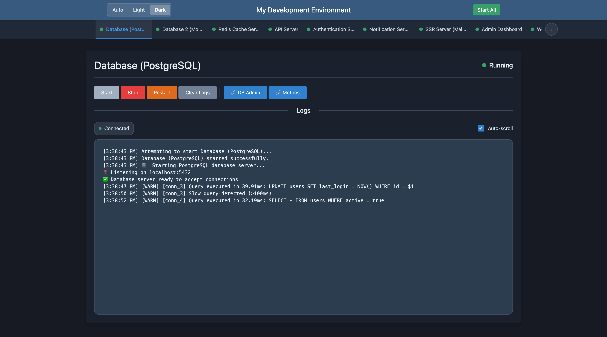

# Dev Services Dashboard v0.0.4

[](https://badge.fury.io/js/dev-services-dashboard)


A lightweight development UI dashboard for managing and monitoring multiple services during local development.

[](screenshot.png)

<!-- toc -->

- [Overview](#overview)
- [Features](#features)
- [Usage](#usage)
  - [Quick Setup](#quick-setup)
  - [Configuration Options](#configuration-options)
  - [Service Configuration](#service-configuration)
    - [Web Links](#web-links)
  - [Logger Configuration](#logger-configuration)
    - [No Logging by Default](#no-logging-by-default)
    - [Using the Console Logger](#using-the-console-logger)
    - [Creating a Custom Logger](#creating-a-custom-logger)
    - [Disabling Logging](#disabling-logging)
- [Example](#example)
- [Demo](#demo)
- [Development](#development)
  - [Project Structure](#project-structure)
  - [backend](#backend)
  - [frontend-react](#frontend-react)
  - [frontend-build](#frontend-build)
  - [Technical Details](#technical-details)
- [Future Goals](#future-goals)

<!-- tocstop -->

## Overview

Dev Services Dashboard provides a web-based dashboard to:

- Start, stop, and restart development services
- Monitor service logs in real-time
- Track service status (running, stopped, error, etc.)
- Manage multiple services from a single interface
- Define and spin up your entire local development stack (databases, APIs, web servers, etc.)

Perfect for local development where you need to run multiple interdependent services that would typically be separate managed services in production (databases, caches, message queues, microservices, etc.).

## Features

- **Real-time Logs**: View service logs as they happen
- **Service Controls**: Start, stop, restart services individually or all at once
- **Status Monitoring**: Visual indicators for service status
- **Web Links**: Quick access buttons to related URLs (docs, admin panels, health checks, etc.)
- **Connection Status**: Clear indication of connection state with automatic reconnection
- **Responsive Design**: Works on desktop and mobile devices

## Usage

### Quick Setup

1. **Install the package:**

   ```bash
   bun install dev-services-dashboard
   # or
   npm add dev-services-dashboard
   # or
   yarn add dev-services-dashboard
   ```

2. **Create a dev runner script** (e.g., `scripts/dev-ui-runner.ts`):

   ```typescript
   import {
     createConsoleLogger,
     startDevServicesDashboard,
     type UserServiceConfig,
   } from "dev-services-dashboard";

   const services: UserServiceConfig[] = [
     {
       id: "db",
       name: "Database (Postgres)",
       command: ["bun", "run", "scripts/dev-db.ts"],
     },
     {
       id: "api",
       name: "API Server",
       command: ["bun", "run", "src/apps/api-server/index.ts"],
       env: { NODE_ENV: "development" },
       webLinks: [
         { label: "API Docs", url: "http://localhost:3001/docs" },
         { label: "Health Check", url: "http://localhost:3001/health" },
       ],
     },
   ];

   startDevServicesDashboard({
     dashboardName: "My Project Dashboard",
     port: 4000,
     hostname: "localhost",
     maxLogLines: 200,
     defaultCwd: process.cwd(),
     services,
     logger: createConsoleLogger(),
   });

   console.log("Dev Services Dashboard Started!");
   ```

3. **Add a script to your `package.json`:**

   ```json
   {
     "scripts": {
       "dev:dashboard": "bun run scripts/dev-ui-runner.ts"
     }
   }
   ```

4. **Run your dashboard:**

   ```bash
   bun run dev:dashboard
   ```

   **Note**: This Quick Setup example uses Bun, but you can also use Node.js with ts-node or regular JavaScript:

```bash
# With ts-node (for TypeScript)
  npx ts-node scripts/dev-ui-runner.ts

 # Or with regular Node.js (rename to .js and remove types)
 node scripts/dev-ui-runner.js
```

5. **Open your browser** to `http://localhost:4000` to access the dashboard (or on your custom defined port)

### Configuration Options

The `startDevServicesDashboard` function accepts a configuration object with the following properties:

| Option          | Type                               | Default                  | Description                                                      |
| --------------- | ---------------------------------- | ------------------------ | ---------------------------------------------------------------- |
| `port`          | number                             | 4000                     | The port to run the Dev Services Dashboard server on             |
| `hostname`      | string                             | 'localhost'              | The hostname to bind the server to                               |
| `maxLogLines`   | number                             | 200                      | Maximum number of log lines to keep in memory per service        |
| `defaultCwd`    | string                             | process.cwd()            | Default working directory for services                           |
| `dashboardName` | string                             | 'Dev Services Dashboard' | Custom name for the dashboard displayed in the UI and page title |
| `services`      | UserServiceConfig[]                | required                 | Array of service configurations                                  |
| `logger`        | DevServicesDashboardLoggerFunction | none (no logging)        | Custom logger function for Dev Services Dashboard internal logs  |

### Service Configuration

Each service is defined with the following properties:

| Property   | Type                   | Required | Description                                                          |
| ---------- | ---------------------- | -------- | -------------------------------------------------------------------- |
| `id`       | string                 | Yes      | Unique identifier for the service                                    |
| `name`     | string                 | Yes      | Display name for the service                                         |
| `command`  | string[]               | Yes      | Command to run (first element is the executable, rest are arguments) |
| `cwd`      | string                 | No       | Working directory for the command (defaults to defaultCwd)           |
| `env`      | Record<string, string> | No       | Environment variables to set for the process                         |
| `webLinks` | WebLink[]              | No       | Array of web links to display as buttons in the service UI           |

#### Web Links

Web links appear as clickable buttons in each service's control panel. Each web link is defined with:

| Property | Type   | Required | Description                            |
| -------- | ------ | -------- | -------------------------------------- |
| `label`  | string | Yes      | Display text for the link button       |
| `url`    | string | Yes      | URL to open when the button is clicked |

**Note**: The URLs in the examples below are for demonstration purposes. Make sure the URLs you configure actually correspond to running services or endpoints that your services expose.

### Logger Configuration

Dev Services Dashboard supports pluggable logging to integrate with your existing logging infrastructure or to disable logging entirely.

#### No Logging by Default

By default, Dev Services Dashboard doesn't log anything unless you provide a logger:

```typescript
import { startDevServicesDashboard } from "dev-services-dashboard";

// No internal logging
startDevServicesDashboard({
  services: [...],
});
```

#### Using the Console Logger

To enable console logging, use the provided console logger factory:

```typescript
import { startDevServicesDashboard, createConsoleLogger } from "dev-services-dashboard";

// Enable console logging
startDevServicesDashboard({
  services: [...],
  logger: createConsoleLogger(),
});

// For easy on/off control based on environment
const LOGGING_ENABLED = process.env.NODE_ENV === "development";
startDevServicesDashboard({
  services: [...],
  logger: createConsoleLogger(LOGGING_ENABLED),
});
```

#### Creating a Custom Logger

You can provide your own logger function:

```typescript
import { startDevServicesDashboard, type DevServicesDashboardLoggerFunction } from "dev-services-dashboard";

const customLogger: DevServicesDashboardLoggerFunction = (type, message, data) => {
  // Integrate with your logging system
  myLogger.log({
    level: type,
    message,
    data,
    service: "dev-services-dashboard"
  });
};

startDevServicesDashboard({
  services: [...],
  logger: customLogger,
});
```

#### Disabling Logging

To disable all Dev Services Dashboard internal logging:

```typescript
import { startDevServicesDashboard } from "dev-services-dashboard";

// Provide a no-op logger
startDevServicesDashboard({
  services: [...],
  logger: () => {}, // No logging
});
```

## Example

```typescript
// scripts/dev-ui-runner.ts
import {
  startDevServicesDashboard,
  type UserServiceConfig,
} from "dev-services-dashboard";

const services: UserServiceConfig[] = [
  {
    id: "db",
    name: "Database (Postgres)",
    command: ["bun", "run", "scripts/dev-db.ts"],
    webLinks: [{ label: "Admin Panel", url: "http://localhost:5432/admin" }],
  },
  {
    id: "api",
    name: "API Server",
    command: ["bun", "run", "src/apps/api-server/index.ts"],
    env: { NODE_ENV: "development" },
    webLinks: [
      { label: "API Docs", url: "http://localhost:3001/docs" },
      { label: "Health Check", url: "http://localhost:3001/health" },
    ],
  },
  {
    id: "ssr",
    name: "SSR Server (Main Website)",
    command: ["bun", "run", "src/apps/main-website/ssr-server.ts"],
    env: { NODE_ENV: "development" },
    webLinks: [
      { label: "Website", url: "http://localhost:3000" },
      { label: "Dev Tools", url: "http://localhost:3000/__dev" },
    ],
  },
];

startDevServicesDashboard({
  port: 4000,
  hostname: "localhost",
  maxLogLines: 200,
  services,
});

console.log("Dev Services Dashboard started");
```

## Demo

Want to see Dev Services Dashboard in action? We've included a demo with simulated services:

```bash
# Clone the repository
git clone https://github.com/keverw/dev-services-dashboard.git
cd dev-services-dashboard

# Install dependencies
bun install

# Run the demo (automatically builds frontend bundle)
bun run demo
```

The demo includes simulated services that generate realistic logs:

- **Database Server**: SQL queries, connection management, and maintenance logs
- **API Server**: HTTP requests, middleware activity, and error scenarios
- **SSR Server**: Page rendering, hot reload, and build processes

Open http://localhost:4000 to explore the dashboard and try features like starting/stopping services, viewing real-time logs, and using the "Start All" functionality.

## Development

Dev Services Dashboard is built with TypeScript and uses modern JavaScript features.

```bash
# Install dependencies
bun install

# Build the project (includes React frontend build)
bun run build

# Run tests
bun test

# Run the demo (includes frontend bundle generation)
bun run demo

# Develop the React frontend with hot reload
bun run dev-frontend
```

**Note**: The React frontend is built using Vite and then bundled into a Virtual File System (VFS) during the build process. The generated `src/backend/frontend-vfs.ts` file is git-ignored as it's a build artifact, but it's required for the server to run. The demo command automatically builds the React frontend and generates this file before starting.

When preparing a new release:

1. Update the version in `package.json`
2. Update the `changelog.md` file with the new version and changes
3. Run the build command, which will automatically build the frontend assets VFS, lib distributable update the README version and changelog TOC

```bash
# Build the project (includes README version update)
bun run build
```

The build process first builds the React frontend using Vite, then creates the VFS bundle, and finally builds the backend library. It also uses the `update-readme` and `update-changelog` scripts defined in package.json. The `update-readme` script runs `markdown-toc-gen` to update the table of contents and then runs `scripts/update-readme-version.ts` to synchronize the version number in the README with the one in package.json. The `update-changelog` script also uses `markdown-toc-gen` to update the changelog's table of contents. Afterwards, you can publish the package to npm:

```bash
# Publish to npm
bun publish
```

Make sure to commit the new version back to GIT

### Project Structure

### backend

This is where the `startDevServicesDashboard` is imported from. This is responsible for managing the service underlying processes, the HTTP API and WebSocket Handler.

### frontend-react

This is where the React frontend source files are maintained. The frontend is built using Vite and TypeScript, providing a modern development experience with hot module replacement and type safety.

### frontend-build

This directory contains the built React application output from Vite. The build process compiles TypeScript, bundles JavaScript, and optimizes assets for production.

### Technical Details

The Dev Services Dashboard consists of:

- An HTTP server using Node's native `http` module that manages service processes and provides a WebSocket API
- WebSocket communication powered by the `ws` library
- A web interface that communicates with the server via WebSockets
- Real-time log streaming from services to the UI

## Future Goals

- **Headless Mode**: Support running Dev Services Dashboard without serving the web interface, ideal for building IDE extensions or integrating with other development tools
- **Authentication & Security**: Currently designed for local development environments without authentication. Future versions could include optional authentication mechanisms for team environments or remote access scenarios
